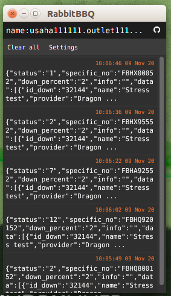
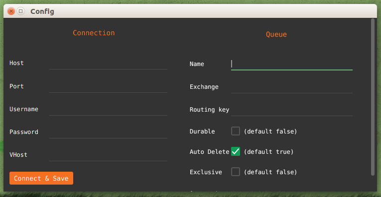

# RabbitBBQ
  Simple RabbitMQ reciever build in Java

## On Development

## Download app 
  - [rabbitbbq-1.1.0 installer.deb](https://github.com/rizalmf/RabbitBBQ/blob/master/out/rabbitbbq-1.1.0%20installer.deb) (Debian/Ubuntu).
  - [Older version ..](https://github.com/rizalmf/RabbitBBQ/tree/master/out)

## Screenhots

### Changelog
- **v1.0.0 (build ready)**
   - initial commit
- **v1.1.0 (build ready)**
   - feature/publish_subscribe
     (add basic publish. temporary disable headers, arguments, properties (bug))
